# Companion app

A companion Android application designed to extend and simplify the configuration of the aa-proxy project.

The app provides an easy way to manage aa-proxy settings, configure EV routing support for Google Maps, monitor logs, update firmware, and access additional advanced features directly from your Android device.

# Features

## Configuration

The companion app allows full configuration of aa-proxy using multiple communication channels:

- Bluetooth (GATT)
- WiFi (while connected through Android Auto)
- VEC (Vendor Extension Channel) using the AA protocol itself

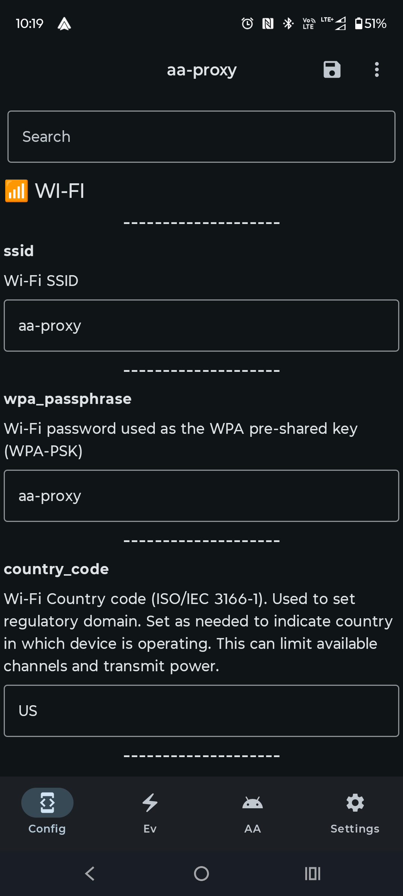

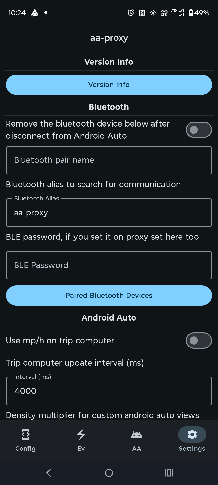

Each option can be searched/filtered by its name/description:
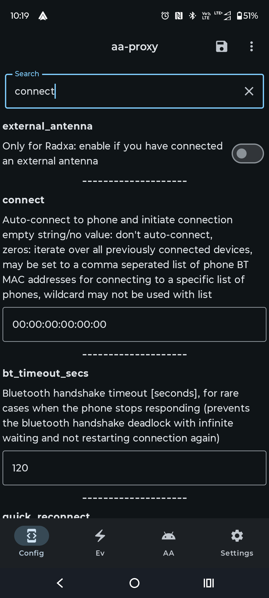

This makes setup and maintenance significantly easier without requiring manual editing or external tooling.

## EV Routing Configuration

One of the initial features of the app is EV profile configuration for Google Maps EV Routing support.

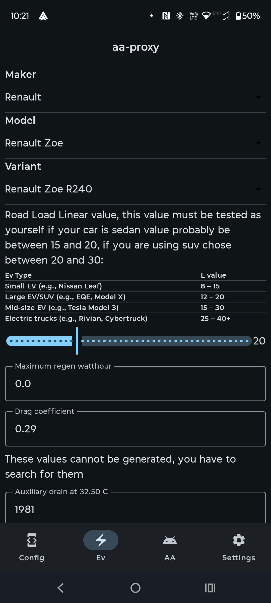

The application allows you to:

- Select a vehicle from the internal database
- Adjust and fine-tune vehicle parameters
- Customize charging and consumption-related values
- Save the configured model directly into aa-proxy

The vehicle database itself is built from scraped public vehicle information combined with additional reverse-engineered data and tuning.

## Application Logs

The app provides built-in log access for easier debugging and diagnostics.

This allows users to:

- View runtime logs
- Analyze connection issues
- Verify EV routing behavior
- Troubleshoot firmware or configuration problems

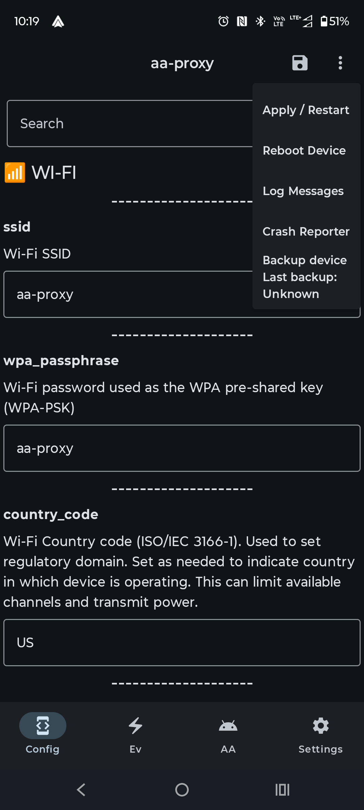

## Automatic "you know what" Updates

The app includes automatic updating of "you know what".

Yes, exactly that ;).

If you don't know what we mean here, join our [Discord](https://discord.gg/c7JKdwHyZu) server.

## Firmware Management

The companion app can also:

- Upgrade aa-proxy firmware via OTA upgrade files for supported boards

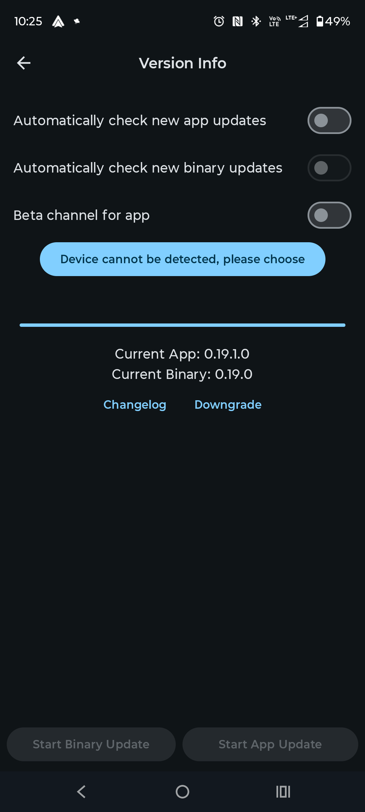

This simplifies maintenance and avoids manual flashing or update procedures.

## Plugins

The application includes a system of separately installable plugins. Using these plugins, it is possible to create any screen that will later appear in the main Android Auto menu.

Plugins are installed as separate APK packages on Android and can then be enabled in the following menu:
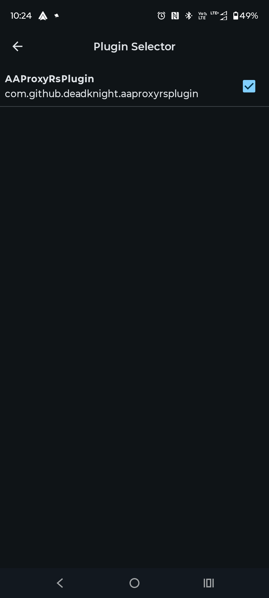

Once enabled, you can enjoy your new plugin. Example plugin for the Renault Zoe, adding an onboard computer visualization:
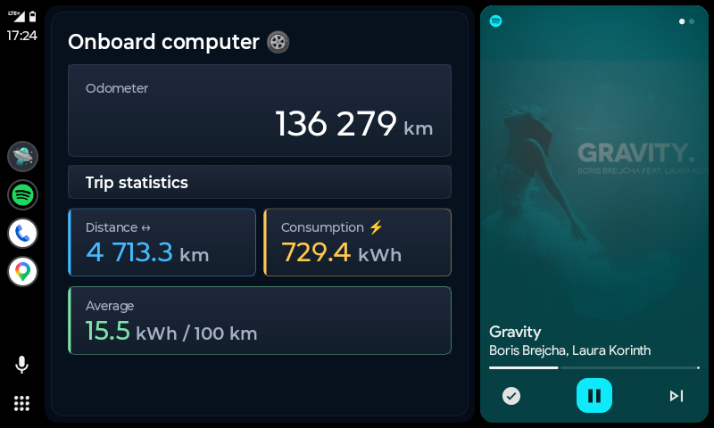

as well as TPMS (tire pressure monitoring):
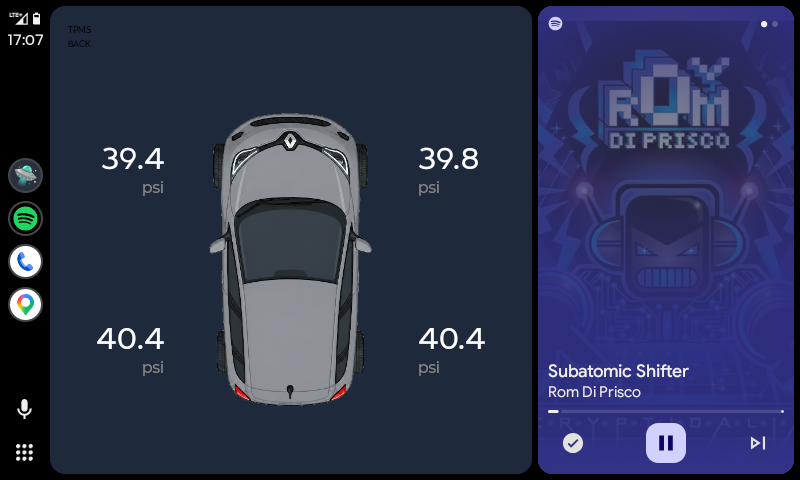

Example source code for a test plugin can be found here:  
https://github.com/aa-proxy/companion-app-sample-aa-plugin

The README describes the project structure, and the plugin can be built using the included Docker setup.

## Other features

- Manually injecting battery level for EV cars:
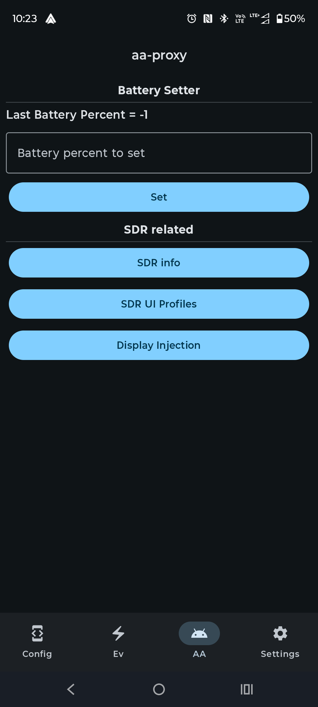

- List and export crash reports:
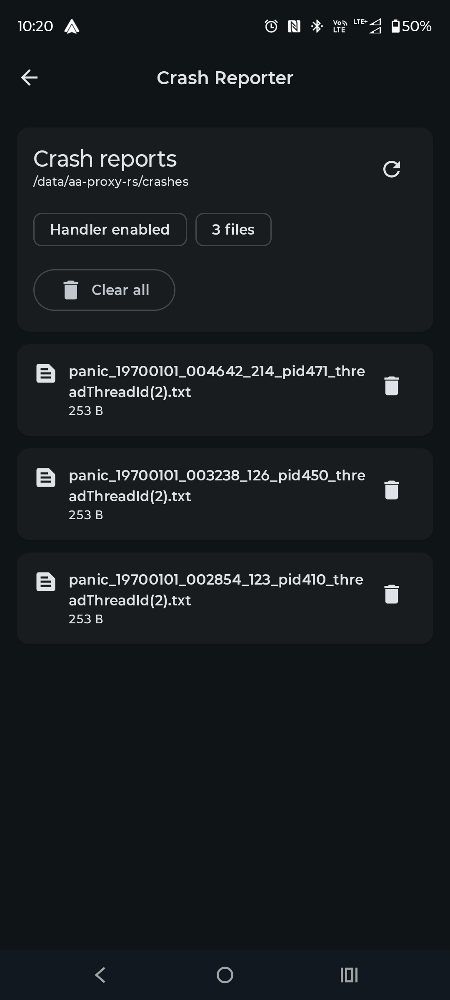

- Display injections for configuring additional virtual screens:
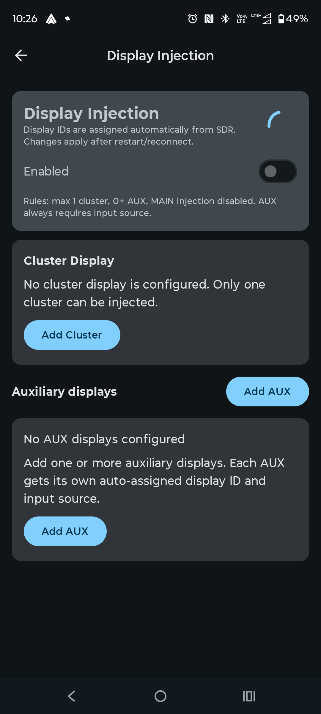

## Why The App Is Not Public

Unfortunately, the application is currently not publicly available and the source code remains in a private aa-proxy Github organization repository for now.

Most of the work was done by [@Deadknight](https://github.com/Deadknight), including reverse engineering large parts of the Android Auto APK itself. This went far beyond basic protocol inspection and involved deep analysis of formulas, internal logic, and behaviors discovered through extensive experimentation and research.

A large amount of effort also went into:

- reverse engineering EV-related protobuf structures
- building custom tooling
- scraping and normalizing vehicle databases
- integrating all of it into a working ecosystem

For those reasons we currently prefer to keep the project private.

Google-related concerns are also part of that decision.  
We are slightly worried about potential changes that could break or completely block the functionality of the entire project, and we'd rather avoid attracting unnecessary attention for now.

The goal of the project is not to bypass or harm the ecosystem, but rather to improve and extend functionality that Google itself either does not provide or cannot provide — all in the spirit of open-source experimentation and community-driven development.

Maybe one day the companion app source code will become public.  
For now, this setup works well enough for us.

Additionally, we want to emphasize that the entire companion app is completely optional.

If you do not want to use it — you do not have to.  
It is not required for aa-proxy itself to function.

Everything included in the app exists purely to simplify configuration, improve usability, and make day-to-day usage easier. Power users can still manage almost everything manually through configuration files and direct setup without relying on the application.

That said, there are a few features that cannot realistically be configured without the companion app, such as:

- the Android Auto in-car application interface
- plugins responsible for presenting and visualizing data
- certain interactive integration features (eg. manually sending battery percentage to EV)

## Installation

The companion application is distributed as an APK package and hosted on our server:

🤖 Android Companion App  
http://152.70.21.153/app-release-250520261249.apk

Future updates should be available directly from inside the application and can be installed without reinstalling the APK manually.

# Disclaimer

This project is experimental and heavily research-oriented.

Use at your own risk.

Compatibility may vary depending on Android Auto versions, Google Play Services versions, device vendors, and vehicle implementations.
