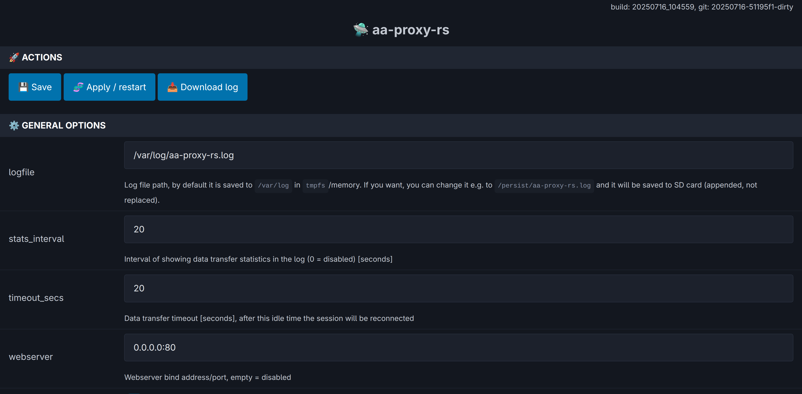

# Getting Started

This guide walks you through the first setup of **aa-proxy**, including flashing the SD card, connecting to your phone and car, and using the web interface for configuration.

---

## 💾 Flashing SD Card

The latest stable SD card images are available on the [Releases page](https://github.com/manio/aa-proxy-rs/releases).  
Download the correct image for your hardware and flash it using your preferred tool (for example, **Raspberry Pi Imager** or **balenaEtcher**).

---

## 🔌 First-Time Connection

1. **Verify Android Auto with your car:**  
   Connect your phone directly to the car head unit (HU) via USB and confirm that Android Auto starts successfully. Then disconnect the phone.

2. **Connect the aa-proxy board:**  
   Use a **data-capable USB cable** and make sure you connect to the correct **OTG-enabled port** on your board:

   - **Raspberry Pi Zero W** and **Raspberry Pi Zero 2 W** → second micro-USB port labeled **“USB”** (not “PWR”)  
   - **Raspberry Pi 3 A+** → the only USB-A port (use a USB-A to USB-A cable)  
   - **Raspberry Pi 4** → the USB-C port (the same one normally used for power)

3. **Pair via Bluetooth:**  
   On your phone, open Bluetooth settings and pair with the new device named `aa-proxy-*`.

4. **Automatic Wi‑Fi connection:**  
   After pairing, your phone should automatically connect via Wi‑Fi. The aa-proxy will then connect to the head unit via USB and start Android Auto on the car display.

From the next connection onward, Android Auto should launch automatically without further setup.

> [!WARNING]  
> For convenience during the first setup, **SSH access is enabled by default** and the device uses a predefined Wi‑Fi password.  
> It is **strongly recommended** to change these defaults or disable SSH entirely for security reasons.

> [!NOTE]  
> 📶 **Default Wi‑Fi credentials:**  
> SSID: `aa-proxy`  
> WPA password: `aa-proxy`  
>
> 🔐 **Default SSH credentials:**  
> User: `root`  
> Password: `password`  
>
> See below for instructions on connecting to the device’s Wi‑Fi network.

---

## 🌐 Embedded Web Interface

When connected to the device’s Wi‑Fi network, open [http://10.0.0.1](http://10.0.0.1) in a web browser to access the built‑in web interface.

> [!WARNING]  
> If you want to access the device (via web or SSH) **while Android Auto is running**, it will not be reachable from the same phone.  
> You have two options:
>
> - Use a **different device** (e.g., laptop or another phone) to connect to the aa-proxy Wi‑Fi network.  
> - Or temporarily **stop Android Auto**, for example by:  
>   - Enabling airplane mode, then re‑enabling Wi‑Fi only and connecting manually, **or**  
>   - Disabling both Wi‑Fi and Bluetooth, waiting a few seconds, then re‑enabling Wi‑Fi and reconnecting.
>
> If connection issues persist, try disabling **MAC address randomization** on your phone.  
> [This guide](https://help.kings.edu/hc/en-us/articles/4406119218455-How-to-Disable-Randomized-MAC-Addresses-on-Android) explains how to do this on Android.

Within the web interface, you can configure all settings available in `/etc/aa-proxy-rs/config.toml`, such as Bluetooth behavior, logging options, and network parameters.

You can also **download logs** directly with a single click for troubleshooting or support purposes.

---
