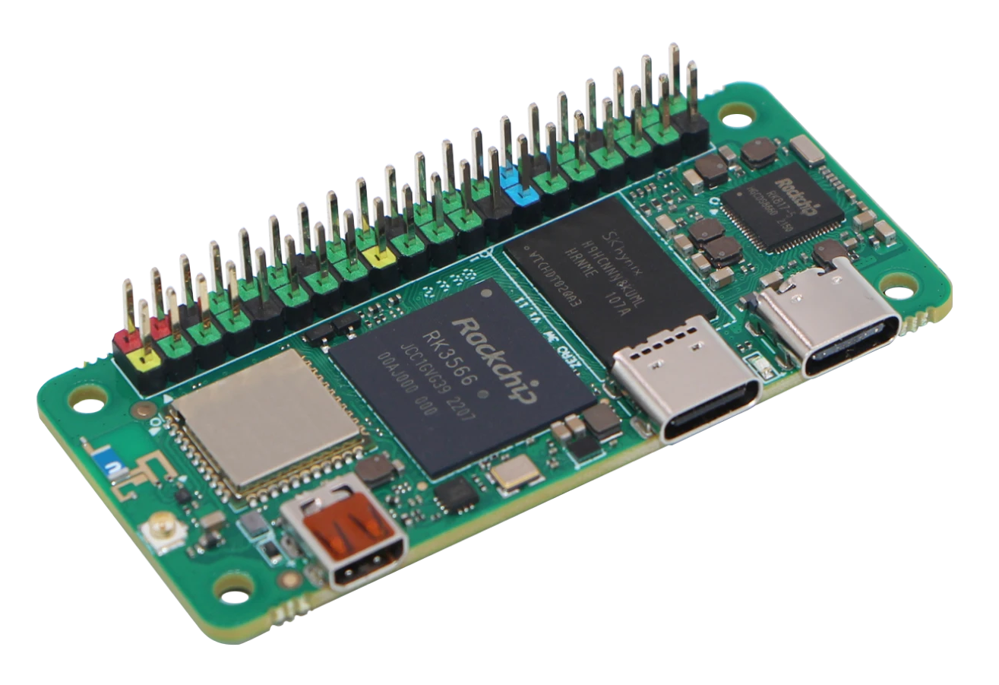
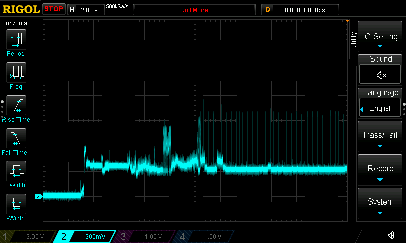
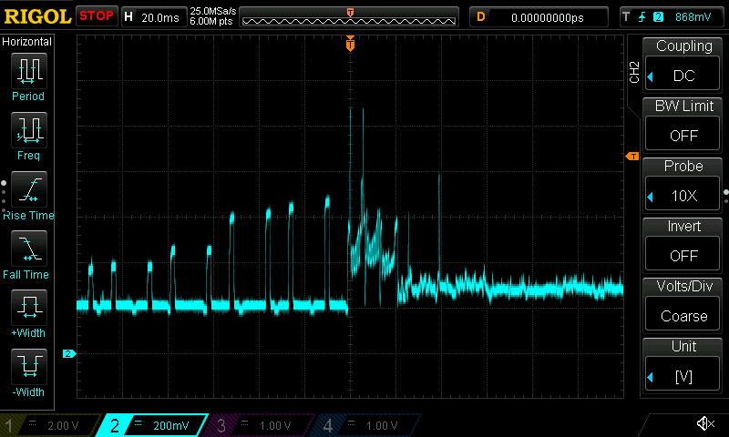
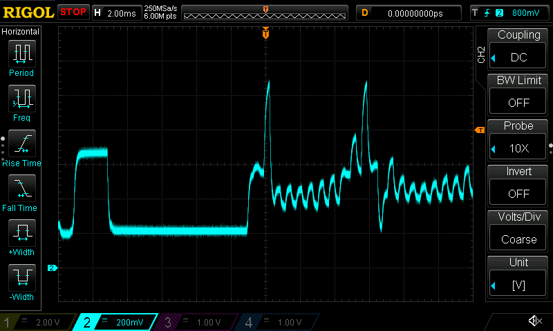
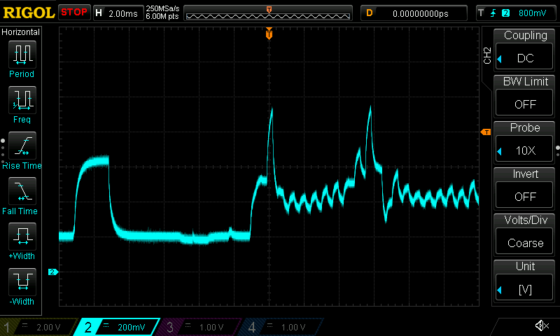
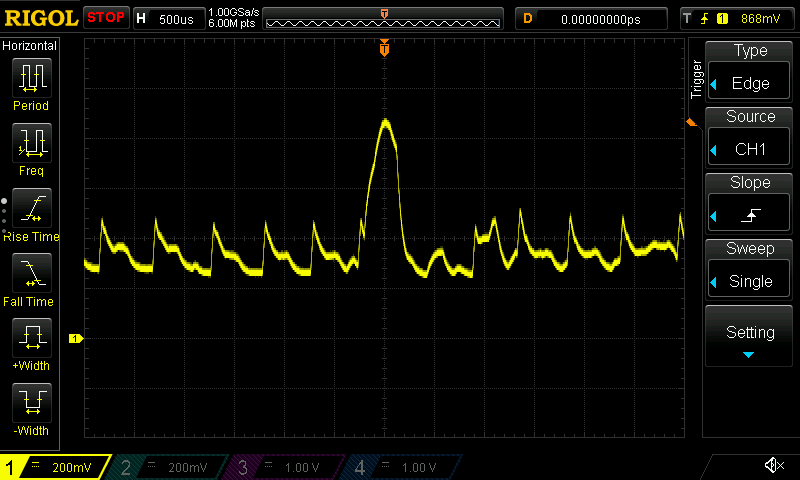
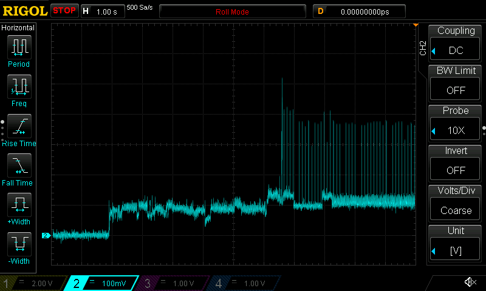
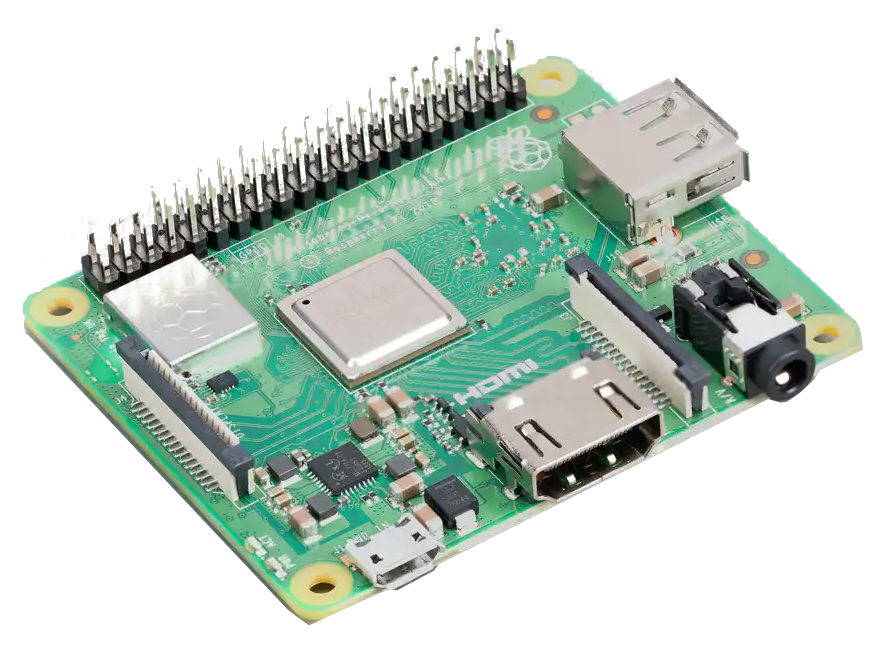
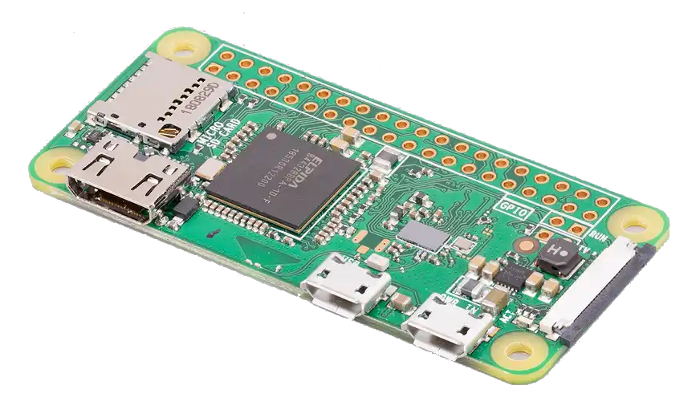

# Supported Hardware

Below is a list of supported hardware. If you’re just starting out and planning to buy something for this project, I recommend choosing boards that support 5GHz Wi-Fi, as support for the 2.4GHz standard in Google services is gradually phasing out.

I’m starting the list with boards featuring the AIC8800 chipset. They support 5GHz Wi-Fi and, in my opinion, handle Bluetooth and Wi-Fi coexistence really well (I personally use a Bluetooth OBD dongle for EV features and Wi-Fi at the same time). Of course, your choice will depend on your preferences, availability in your country, and price (sometimes shipping costs are higher than the board itself, which obviously defeats the purpose).

From our Discord community, it turns out the most popular board among users is the Pi Zero 2 W. I’ve used it for years in this project, but having a direct comparison with other boards, you can often get a MilkV or Radxa board for the same price, which are much better suited for our use case.

Please also keep in mind that the order of the list is just my subjective take on what works best for this project. I don’t want this to be misunderstood as some ultimate truth carved in stone. For example, the Pi Zero 2 W being close to the bottom doesn’t mean it’s a bad board. There are scenarios where it works great – in my car it ran fine for a long time without any stuttering, until I started relying more heavily on Bluetooth alongside Wi-Fi. There *are* configurations where a Raspberry Pi is perfectly good enough, and its low power consumption is definitely a plus.

A clear advantage of Raspberry Pi boards is their huge popularity, which also means great availability. However, the Broadcom radio chipset they all use leaves a lot to be desired, in my opinion.

The thing with the Pi Zero 2 W (and Broadcom’s radio chipset in general) is that when you try to connect to a Bluetooth device – especially one that’s out of range – the Wi-Fi link tends to suffer. You start losing pings, and the Android Auto connection can drop entirely. That’s the main reason why, for this specific use case, other boards tend to perform better.

## Notes on Specifications, Measurements, and Links

The specifications listed below are taken from various sources – mainly official vendor websites, but also my own experience and information gathered from Wikipedia. If you spot any mistake, feel free to let me know!

**Power measurements:** for some boards I managed to measure power consumption using an oscilloscope and a 1-ohm shunt resistor. Whenever I have such data available, I include the corresponding waveforms.

::: warning
**AliExpress links:** I’m simply sharing the links I personally used to buy SBCs. I’m not responsible for them, nor am I affiliated with any seller. You buy at your own risk.
:::

## MilkV DuoS
{width=30%}
| Feature | Specification |
|---------|---------------|
| URL | https://milkv.io/duo-s |
| SoC | SG2000 |
| RISC-V CPU | C906@1Ghz + C906@700MHz |
| Arm CPU | 1 x Cortex-A53@1GHz |
| MCU | 8051@6KB SRAM |
| Storage | 1 x microSD connector, optional onboard eMMC |
| RAM | SIP DRAM 512MB |
| USB | 1 x Type-C for power and data or 1x USB 2.0 A Port HOST |
| Wireless | Optional WIFI6 / BT5.4 onboard |
| Ethernet | 100Mbps ethernet port(RJ45) onboard |
| Power | 5V/1A |
| Dimentions | 43mm x 43mm |
| Others | 1x BOOT swich, 1x Recovery Key, 1x RST Key |
| AliExpress | https://www.aliexpress.com/item/1005006719645936.html |
::: info
The aa-proxy image is prepared to run on the RISC-V core, not on the ARM Cortex one (which is probably good news, since it means it draws less current).

Even though the board supports eMMC, at the moment only SD card booting is supported. eMMC support is planned for the future.
:::

## Radxa ZERO 3W
{width=40%}
| Feature | Specification |
|---------|---------------|
| URL | https://radxa.com/products/zeros/zero3w/ |
| SoC | Rockchip RK3566 |
| CPU | Quad‑core Arm® Cortex®‑A55 (Armv8) 64‑bit @ 1.6GHz |
| Storage | Option Onboard eMMC: 8GB / 16GB / 32GB / 64GB   1 x Micro SD Card Slot |
| RAM | 1GB / 2GB / 4GB / 8GB LPDDR4 |
| USB | 1x USB 2.0 OTG Type C Port   1x USB 3.0 Host Type C Port |
| Wireless | IEEE 802.11b/g/n/ac/ax(WiFi6) and BT 5.4 with BLE   Enable External or Onboard Antenna via Software Control |
| Operating Conditions | Recommended environmental temperature: 0 ~ 50°C   Radxa ZERO 3W has a temperature limit of 80°C, beyond which it throttles clock speeds for reliability   For continuous high-performance use, external cooling methods like heat sinks or fans can maintain maximum clock speed below the 80°C limit |
| Power | Requires 5V/2A power adapter |
| Dimentions | 65 mm × 30 mm |
| AliExpress | https://www.aliexpress.com/item/1005007614734251.html |
::: details Current draw waveforms

:::

## AAWireless TWO
{width=30%}
| Feature | Specification |
|---------|---------------|
| URL | https://www.aawireless.io/en/products/aawireless-two |
| SoC | Rockchip RV1103 |
| CPU | 1× ARM Cortex-A7 32-bit |
| Storage | SPI Flash 256MB |
| Wi-Fi | 802.11a/b/g/n (Realtek RTL8733BS) |
| Bluetooth | Bluetooth v2.1+EDR/v5.2 |
| USB | 1× USB-C |
::: danger
Flashing aa-proxy will void your warranty, and at this moment there's no way to restore the original firmware.
:::
::: info
To flash the image, you’ll need to open the case and short two pins to force the device into maskrom mode. Once it’s in that state, you can use the flashing script available here to upload the new firmware:
https://github.com/aa-proxy/buildroot/tree/main/tools/aaw
:::
::: details Current draw waveforms

:::

## Raspberry Pi 4
{width=50%}
| Feature | Specification |
|---------|---------------|
| URL | https://www.raspberrypi.com/products/raspberry-pi-4-model-b/ |
| SoC | BCM2711 |
| CPU | 4× Cortex-A72 @ 1.5 GHz or 1.8 GHz |
| RAM | 1, 2, 4 or 8 GB |
| Storage | MicroSDHC slot |
| Wi-Fi | 2.4/5 GHz 802.11b/g/n/ac |
| Bluetooth | Bluetooth 5.0/BLE |
| Ethernet | 1× Gigabit |
| USB | 2× USB 3.0, 2× USB 2.0, 1 (Power USB-C) |
| Power | 3A (15 W) power supply recommended |
| Dimentions | 85.60 × 56.5 × 17 mm |

## Raspberry Pi 5
{width=40%}
| Feature | Specification |
|---------|---------------|
| URL | https://www.raspberrypi.com/products/raspberry-pi-5/ |
| SoC | BCM2712 |
| CPU | 4× Cortex-A76 @ 2.4 GHz |
| RAM | 2, 4, 8 or 16 GiB |
| Storage | MicroSDHC UHS-1 Slot |
| Wi-Fi | 2.4/5 GHz 802.11b/g/n/ac |
| Bluetooth | Bluetooth 5.0/BLE |
| Ethernet | 1× Gigabit |
| USB | 2× USB 3.0, 2× USB 2.0 |
| Power | 12 W |
| Dimentions | 85 × 56 mm |

## Raspberry Pi 3 A+
{width=40%}
| Feature | Specification |
|---------|---------------|
| URL | https://www.raspberrypi.com/products/raspberry-pi-3-model-a-plus/ |
| SoC | BCM2837 |
| CPU | 4× Cortex-A53 @ 1.4 GHz |
| RAM | 512 MiB |
| Storage | MicroSDHC slot |
| Wi-Fi | 2.4/5 GHz 802.11b/g/n/ac |
| Bluetooth | Bluetooth 4.2/BLE |
| USB | 1× USB 2.0 |
| Dimentions | 65 × 56.5 mm |

## Raspberry Pi Zero 2 W
{width=40%}
| Feature | Specification |
|---------|---------------|
| URL | https://www.raspberrypi.com/products/raspberry-pi-zero-2-w/ |
| SoC | BCM2710 |
| CPU | 4× Cortex-A53 @ 1 GHz |
| RAM | 512 MiB |
| Storage | MicroSDHC slot |
| Wi-Fi | 2.4 GHz 802.11b/g/n |
| Bluetooth | Bluetooth 4.2/BLE |
| USB | 1 Micro-USB 2.0 OTG, 1 Micro-USB for power |
| Power | 120 mA (0.6 W) average when idle |
| Dimentions | 65 × 30 × 5 mm |

## Raspberry Pi Zero W
{width=40%}
| Feature | Specification |
|---------|---------------|
| URL | https://www.raspberrypi.com/products/raspberry-pi-zero-w/ |
| SoC | BCM2835 |
| CPU | 1× ARM11 @ 1 GHz |
| RAM | 512 MiB |
| Storage | MicroSDHC slot |
| Wi-Fi | 2.4 GHz 802.11b/g/n |
| Bluetooth | Bluetooth 4.2/BLE |
| USB | 1 Micro-USB 2.0 OTG, 1 Micro-USB for power |
| Power | 100 mA (0.5 W) average when idle, 350 mA (1.75 W) maximum under stress (monitor, keyboard and mouse connected) |
| Dimentions | 65 × 30 × 5 mm |
