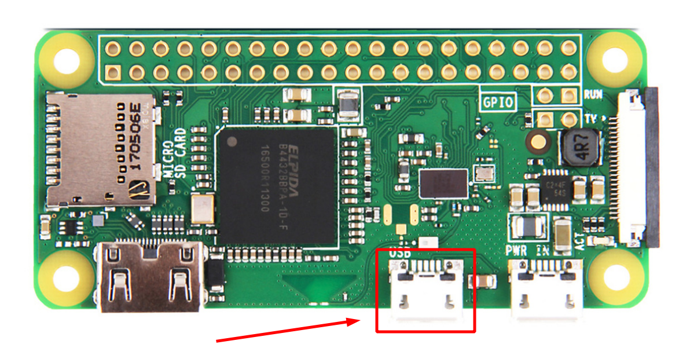
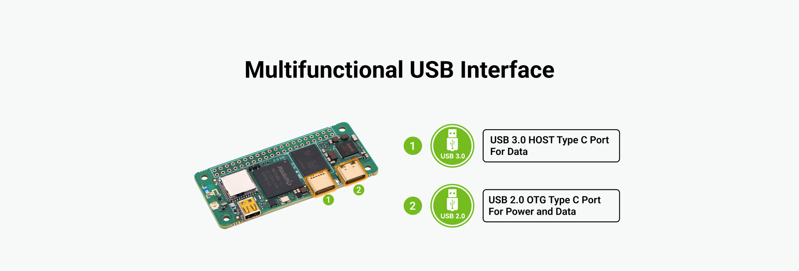

# Troubleshooting Guide

This guide helps you diagnose and resolve common issues with **aa-proxy** connectivity and performance.

---

## 🧭 How It Works (Ideal Scenario)

Before troubleshooting connection problems, it’s important to understand how things should work in a perfect setup.

In an ideal situation:

1. Power up your device running **aa-proxy** and connect it to the car’s head unit (HU).  
   A freshly flashed image should boot up and wait for the first phone connection.

2. You should see a visible Wi‑Fi network named **aa-proxy** and a Bluetooth device named **aa-proxy-\***.  
   If neither is visible, there may be a **power issue** — check [Power Problems](#-power-and-usb-cable-problems).

3. Before the first connection, it’s a good idea to pair your **phone directly with the car (HU)** via Bluetooth — this ensures your phone has the correct hands-free profile.

4. On your phone, enable Bluetooth, search for new devices, and pair with **aa-proxy**.

5. Once paired, **Android Auto (AA)** will begin the initial connection process.

6. The phone receives Wi‑Fi credentials and connects to the **aa-proxy** Wi‑Fi network.

7. Under the hood, **aa-proxy** simultaneously connects to the car’s HU via Bluetooth, emulating a mobile device.

8. The phone should then automatically connect its Bluetooth audio profile to the HU.

9. After a successful connection, data packets flow in both directions — typically in **passthrough mode** (no modification).

10. The proxy saves the paired Bluetooth device in its configuration. On the next boot, **aa-proxy** automatically attempts to reconnect to that phone.

---

## ⚡ Power and USB Cable Problems

A poor-quality cable or incorrect port usage can cause unstable operation.

### 1. Cable Quality
- Use a **good-quality USB cable** — not all cables are equal.
- Better cables use thicker copper conductors and handle higher current.
- Price isn’t always a reliable indicator — some cheap cables perform better than expensive ones.

### 2. Correct USB Port

Ensure the device is powered from the correct **OTG/data port**.

#### Raspberry Pi Zero 2 W


#### Radxa Zero 3W


### 3. LED Indicators (Radxa Only)

You can determine the device status by the **LED indicator**:

- **Steady green** → The device has power but cannot boot (check SD or eMMC image integrity).  
- **Double green blink (repeating)** → System booted and ready.

---

## 💽 SD Card Issues

It might sound odd, but **many strange behaviors** — freezes, partial boots, or random hangs — often trace back to a **faulty SD card**.

Try using a **different SD card** to eliminate this variable.

---

## 🔐 Connecting via SSH

If you need to access the device shell for diagnostics, you can connect via SSH once the system is up and on the same network.

---

## 🪵 Enabling Persistent Logging

By default, logs are only stored in memory for the current session (from boot to shutdown).  
If issues occur while driving and you cannot access logs immediately, enable **persistent logging** to the SD card:

```ini
logfile = /data/aa-proxy-rs.log
```

This appends logs across sessions.

> **Note:** Raspberry Pi devices have no **RTC clock**, so timestamps start from zero.  
> However, logs are still valuable for diagnosing what went wrong.

---

## 📶 Bluetooth Connection Problems

By default, **aa-proxy** automatically connects to known devices stored in its configuration.  
However, on some hardware (especially Raspberry Pi), the Bluetooth chipset can be unreliable.

If automatic reconnection causes issues, disable it by editing the config:

```ini
connect =
```

This forces manual pairing (as during the first setup) — useful for verifying that Bluetooth works properly and isolating issues.

---

## 🔄 Resetting the Phone’s Android Auto Connection State

Sometimes Android Auto gets into a stuck state. To fully reset it:

1. Turn off Wi‑Fi  
2. Turn off Bluetooth  
3. Clear all Android Auto notifications (e.g., “Connecting to Android Auto...”)  
4. Turn Bluetooth back on

This often helps, especially after repeated failed connection attempts.

---

## 🧹 Forgetting Profiles

If nothing else works, perform a full profile reset:

- Forget **aa-proxy** Bluetooth profile on the phone  
- In Android Auto settings → forget your **car profile**  
- Forget the **car (HU)** Bluetooth profile on the phone  
- Forget the **phone** profile in the car (HU)  
- Factory reset **aa-proxy**:
  ```bash
  rm -rf /var/lib/bluetooth && sync && reboot
  ```

---

## 🎵 Stuttering / Audio Dropouts

Some users experience **stuttering audio or lag**.  
The cause can vary — hardware limits, interference, or phone performance.

### Common causes and fixes:
- **Overheating:** Attach a small heatsink or use a ventilated case.  
- **Interference:** If issues occur in specific locations, change your Wi‑Fi channel.  
- **Poor mobile data:** If music buffers but navigation is smooth, network quality is likely the issue.  
- **Software updates:** Occasionally, Android Auto updates introduce regressions — see [Android Authority article](https://www.androidauthority.com/android-auto-stuttering-music-3597082/).

There’s no single solution — experiment with hardware, Wi‑Fi settings, and phone choice to minimize stuttering.

---
